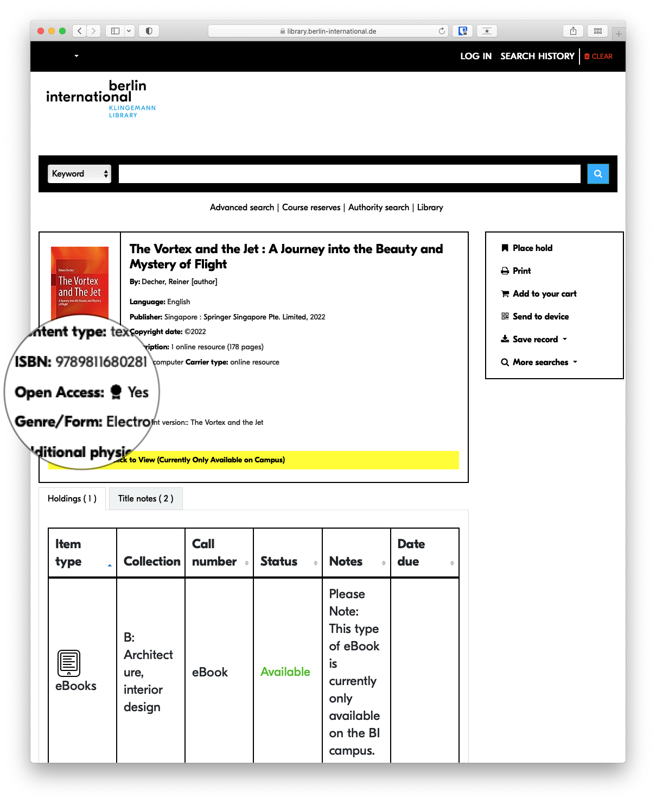

# Checking / showing open access status within the library's catalog

I wanted to use [Directory of Open Access Journals](https://doaj.org) (DOAJ) or [Directory of Open Access Books](https://doabooks.org) (DOAB) to check whether a journal or book in our OPAC was open access (OA) or not. This is particularly valuable for our users because a number of resources are OA but mixed in with other non-OA materials on a platform provided via ProQuest, which is IP-authenticated. On campus users wouldn't notice, but remote users who couldn't access ProQuest were also barred from access to the OA materials.

I must note that while the original request to somehow highlight OA materials in our catalog originally came from a faculty member, the idea to directly query and link to DOAJ/DOAB cam from the [Open Library Badge](https://badge.openbiblio.eu) initiative.

The instructions below are specifically for Koha, but could easily be adapted for other systems that use XSLT files and JavaScript (JS).

##### What is XSLT?

Extensible Stylesheet Language Transformations (XSLT) was originally created to transform XML documents into other formats, and Koha uses them to render html. XSLT files are very useful for pulling in Marc data and displaying it in your catalog. So my first thought was to pull in the ISSN and append as a search parameter for a DOAJ and SHERPA search url.

I began by editing the `opac/htdocs/opac-tmpl/bootstrap/en/xslt/MARC21slim2OPACDetail-custom.xsl` XSLT file, asking it to look up the ISSN, strip it of any additional text, like 'print' or 'pbk', and to plug it into a couple of urls as a search query. I managed to accomplish this but it was a little sloppy, and with DOAJ a 404 page was shown if the journal wasn't in their db, that is to say it wasn't OA.

```xml
<!-- Checking for the existence of datafield with tag value '022' -->
<xsl:if test="marc:datafield[@tag='022']">

  <!-- Looping over each datafield with tag value '022' -->
  <xsl:for-each select="marc:datafield[@tag='022']">

    <!-- Checking for the existence of subfield with code value 'a' -->
    <xsl:if test="marc:subfield[@code='a']">

      <!-- Define variable 'issn' to store the normalized-space value of substring before a space in subfield with code 'a' -->
      <xsl:variable name="issn" select="normalize-space(substring-before(marc:subfield[@code='a'], ' '))"/>

      <!-- Define variable 'sherpa-url' to store the concatenated URL for sherpa.ac.uk search with the 'issn' -->
      <xsl:variable name="sherpa-url" select="concat('https://beta.sherpa.ac.uk/search?term=', $issn)"/>

      <!-- Define variable 'doaj-url' to store the concatenated URL for doaj.org search with the 'issn' -->
      <xsl:variable name="doaj-url" select="concat('https://doaj.org/search/journals?ref=quick-search&amp;source=%7B%22query%22%3A%7B%22query_string%22%3A%7B%22query%22%3A%22', $issn, '%22%2C%22default_operator%22%3A%22AND%22%2C%22default_field%22%3A%22index.issn.exact%22%7D%7D%2C%22track_total_hits%22%3Atrue%7D')"/>

      <!-- Creating a span element with link to Sherpa Romeo -->
      <span class="results_summary issn">
        <a href="{$sherpa-url}" target="_blank" data-toggle="tooltip" data-placement="top" title="Sherpa Romeo is an online resource that aggregates and analyses publisher open access policies and provides summaries of publisher copyright policies.">Check journal status at SHERPA</a>
      </span>

      <!-- Creating a span element with link to DOAJ -->
      <span class="results_summary issn">
        <a href="{$doaj-url}" target="_blank" data-toggle="tooltip" data-placement="top" title="The DOAJ is an index of open access journals.">Check journal status at DOAJ</a>
      </span>

    </xsl:if>
  </xsl:for-each>

</xsl:if>

```

Next I decided to try and use the DOAJ api to determine whether or not the journal was OA.

This was a little more complicated. First I tried using JS directly in the XSLT file to fetch the JSON data via the api, but the XSLT processor that Koha uses can't process JS. So I briefly tried to coax it into using a secondary Saxon processor, but only for the JS bit, but I couldn't get that to work either.

Finally I decided that I would simply put the JS in the OPACUserJS system preference, but I had to sort out a couple of problems first. First, how to get the ISSN into the api query now that the JS wasn't in the XSLT, after all the whole reason you'd use the XSLT is because it can pull directly from Marc records when JS can't.

To address the this, I asked the XSLT to toss the ISSN into the HTML as a data attribute.

```xml
<div class="record">
  <xsl:attribute name="data-issn">
  <xsl:value-of select="$issn"/>
  </xsl:attribute>
</div>
```

That would result in something like this in the rendered HTML:

```html
<div class="record" data-issn="0000-0000">

</div>
```

Now that I had the ISSN loaded in a form I could use, I needed the JS.

```javascript
// Select all elements with the class ".record" and store them in the variable 'recordElements'
var recordElements = document.querySelectorAll(".record");

// Loop through each element in 'recordElements'
recordElements.forEach(function(recordElement) {
  // Get the 'data-issn' attribute from the current element and store it in the variable 'issn'
  var issn = recordElement.getAttribute("data-issn");
  // Create the URL for the API call using the 'issn' variable
  var apiUrl = "https://doaj.org/api/search/journals/issn%3A" + encodeURIComponent(issn);

  // Fetch the data from the API
  fetch(apiUrl)
    .then(function(response) {
      // If the API call was not successful, throw an error
      if (!response.ok) {
        throw new Error("Network response was not ok");
      }
      // If the API call was successful, parse the JSON response
      return response.json();
    })
    .then(function(data) {
      // Extract the 'results' from the JSON data
      var results = data.results;
      // If there are any results, do the following:
      if (results.length > 0) {
        // Get the 'oa_start' property from the first result and store it in the 'oaStart' variable
        var oaStart = results[0].bibjson.oa_start;

        // Create a new 'div' element and store it in the 'resultsDiv' variable
        var resultsDiv = document.createElement("div");
        // Set the inner HTML of the 'resultsDiv' to be "OA Start Date: " followed by the 'oaStart' date
        resultsDiv.innerHTML = "OA Start Date: " + oaStart;
        // Append the 'resultsDiv' to the current record element
        recordElement.appendChild(resultsDiv);
      }
    })
    // If there is an error with the fetch request, log it to the console
    .catch(function(error) {
      console.log("Error:", error);
    });
});

```

Here I specifically pull a piece of data called **oa\_start**, which is just the year the journal went OA.

The final problem was that this JS was being loaded before the HTML content with the ISSN data attribute, so I wrapped it in a **DOMContentLoaded** to force it to load later.

```javascript
// Adds a function to be executed once the HTML document has been completely loaded.
document.addEventListener("DOMContentLoaded", function() {
  
  // Selects all elements with the class name "record" in the document.
  var recordElements = document.querySelectorAll(".record");

  // For each record element found...
  recordElements.forEach(function(recordElement) {
    
    // ... it retrieves the "data-issn" attribute.
    var issn = recordElement.getAttribute("data-issn");
    
    // Constructs the API URL by encoding the ISSN value and appending it to the base URL.
    var apiUrl = "https://doaj.org/api/search/journals/issn%3A" + encodeURIComponent(issn);

    // Fetches data from the API URL.
    fetch(apiUrl)
      .then(function(response) {
        // If the response is not ok (e.g., server responded with a status like 404 or 500), it throws an error.
        if (!response.ok) {
          throw new Error("Network response was not ok");
        }
        // If the response is ok, it parses the response as JSON.
        return response.json();
      })
      .then(function(data) {
        // Retrieves the results from the parsed JSON data.
        var results = data.results;
        
        // If there are results...
        if (results.length > 0) {
          // ... it gets the OA start date from the first result.
          var oaStart = results[0].bibjson.oa_start;

          // Creates a new "div" element.
          var resultsDiv = document.createElement("div");
          // Sets the innerHTML of the "div" to the OA start date.
          resultsDiv.innerHTML = "OA Start Date: " + oaStart;
          
          // Appends the "div" with the OA start date to the record element.
          recordElement.appendChild(resultsDiv);
        }
      })
      // If there's an error during the fetch or processing of data, it logs the error.
      .catch(function(error) {
        console.log("Error:", error);
      });
  });
});

```

Once I got that working as a proof-of-concept, I started to consider what I really wanted to show up in our OPAC. In the end, I just wanted to check whether it had an entry on DOAJ and then if it did to link to the DOAJ page.

##### XSLT

```xml
<!-- ISSN and DOAJ Link -->

<!-- If there's a marc:datafield element with attribute tag='022' -->
<xsl:if test="marc:datafield[@tag='022']">
    
    <!-- For each marc:datafield element with attribute tag='022' -->
    <xsl:for-each select="marc:datafield[@tag='022']">
        
        <!-- If a subfield of the marc:datafield has a code attribute of 'a' -->
        <xsl:if test="marc:subfield[@code='a']">
            
            <!-- Define a variable 'issn' that holds the normalized and trimmed value of the substring before the first space in marc:subfield with attribute code='a' -->
            <xsl:variable name="issn" select="normalize-space(substring-before(marc:subfield[@code='a'], ' '))"/>
            
            <!-- Create a span element with class "results_summary doaj-record" -->
            <span class="results_summary doaj-record">
                
                <!-- Add a custom attribute 'data-issn' to the span element and set its value to the issn variable -->
                <xsl:attribute name="data-issn">
                    <xsl:value-of select="$issn"/>
                </xsl:attribute>
            </span>
        </xsl:if>
    </xsl:for-each>
</xsl:if>

```

##### JS

```javascript
// Adds an event listener for the DOMContentLoaded event.
// This event is fired when the initial HTML document has been completely loaded and parsed,
// without waiting for stylesheets, images, and subframes to finish loading.
document.addEventListener("DOMContentLoaded", function() {
  
  // Selects all elements with the class "doaj-record" and stores them in the recordElements variable.
  var recordElements = document.querySelectorAll(".doaj-record");

  // For each element in recordElements, runs the provided function.
  recordElements.forEach(function(recordElement) {
    
    // Gets the attribute "data-issn" of the current recordElement and stores it in the issn variable.
    var issn = recordElement.getAttribute("data-issn");
    
    // Creates the API URL for the fetch call using the issn variable.
    var apiUrl = "https://doaj.org/api/search/journals/issn%3A" + encodeURIComponent(issn);

    // Makes a fetch request to the apiUrl.
    fetch(apiUrl)
      .then(function(response) {
        
        // If the response was not ok (status in the range 200-299), throws an error.
        if (!response.ok) {
          throw new Error("Network response was not ok");
        }
        
        // If the response was ok, parses the response to JSON and returns it.
        return response.json();
      })
      .then(function(data) {
        
        // Stores the results from the response in the results variable.
        var results = data.results;
        
        // If there is at least one result...
        if (results.length > 0) {
          
          // ...gets the last field from the data and stores it in the lastField variable.
          var lastField = data.last;

          // If the last field exists...
          if (lastField) {
            
            // ...creates a new span element and stores it in the resultsDiv variable.
            var resultsDiv = document.createElement("span");
            
            // ...sets the inner HTML of the resultsDiv to include a link to the journal's TOC in the DOAJ.
            resultsDiv.innerHTML = '<span class="label">Open Access:</span> <span class=""><a href="https://doaj.org/toc/' + issn + '"><i class="bi bi-award-fill"></i> Yes</a></span>';
            
            // ...appends the resultsDiv to the recordElement.
            recordElement.appendChild(resultsDiv);
          } else {
            
            // If the last field does not exist, hides the recordElement.
            recordElement.style.display = "none";
          }
        } else {
          
          // If there are no results, hides the recordElement.
          recordElement.style.display = "none";
        }
      })
      .catch(function(error) {
        
        // If there was an error in the fetch call, logs the error to the console.
        console.log("Error:", error);
      });
  });
});

```

<span style="color: rgb(34, 34, 34); font-size: 1.666em; font-weight: 400;">DOAB</span>

Now I want to do the same with DOAB and books. It is more difficult because the DOAB api will not allow Cross-Origin Resource Sharing (CORS), which means that I wouldn't be able to call the api directly with the JS but would rather need to call the api using a proxy and then access that content with the JS. Luckily setting up a simple PHP proxy doesn't take much time or effort; it only requires a single PHP file such as the one below.

##### proxy.php

```php
<?php
$apiUrl = $_GET['url'];

// Forward the user agent and referer headers
$userAgent = $_SERVER['HTTP_USER_AGENT'];
$referer = $_SERVER['HTTP_REFERER'];

// Set the appropriate headers
header('Content-Type: application/xml');
header('Access-Control-Allow-Origin: *');

// Create a stream context with the Accept, User-Agent, and Referer headers
$context = stream_context_create([
    'http' => [
        'header' => "Accept: application/xml\r\n" .
                    "User-Agent: $userAgent\r\n" .
                    "Referer: $referer\r\n"
    ]
]);

// Make the request to the API URL using the stream context
$response = file_get_contents($apiUrl, false, $context);

// Output the response
echo $response;
?>
```

That's all the set up I needed for the proxy because I placed it inside of an already publicly-accessible directory on my server. Otherwise you may need to configure your PHP-enabled web server to look at the relevant directory and set up all the correct permissions and so forth. Once I had the proxy set up, I added a bit of additional JS to take advantage of it. In this case on line 12.

##### JS

```javascript
 // Select all elements with the class 'doab-record'
  var recordElementsDOAB = document.querySelectorAll(".doab-record");

  // Iterate over each 'doab-record' element
  recordElementsDOAB.forEach(function (recordElement) {
    // Get the ISBN value from the 'data-isbn' attribute
    var isbn = recordElement.getAttribute("data-isbn");
    var encodedIsbn = encodeURIComponent(isbn); // Encode the ISBN once

    // Construct the API URL
    var apiUrl =
      "http://[PROXY URL]/proxy.php?url=" +
      encodeURIComponent(
        "https://directory.doabooks.org/rest/search?query=isbn:" +
          encodedIsbn +
          "&expand=metadata"
      );

    // Fetch the data from the API
    fetch(apiUrl)
      .then(function (response) {
        if (response.ok) {
          return response.text(); // Extract the XML response text
        } else {
          recordElement.style.display = "none"; // Hide the element if API request fails
          throw new Error("API request failed");
        }
      })
      .then(function (xmlText) {
        // Parse the XML response
        var parser = new DOMParser();
        var xmlDoc = parser.parseFromString(xmlText, "text/xml");

        // Find the 'handle' element in the XML
        var handleElement = xmlDoc.querySelector("handle");
        if (handleElement) {
          // Extract the handle value and construct the URL
          var handleValue = handleElement.textContent.trim();
          var url = "https://directory.doabooks.org/handle/" + handleValue;

          // Create and append the result HTML element
          var resultsDiv = document.createElement("span");
          resultsDiv.innerHTML =
            '<span class="label">Open Access:</span> <span class="doab-link"><a href="' +
            url +
            '" target="_blank" data-toggle="tooltip" data-placement="top" title="View in the Directory of Open Access Books"><i class="bi bi-award-fill"></i> Yes</a></span>';
          recordElement.appendChild(resultsDiv);

          // Hide additional doab-record elements
          var additionalRecords =
            recordElement.parentNode.querySelectorAll(".doab-record");
          for (var i = 1; i < additionalRecords.length; i++) {
            additionalRecords[i].style.display = "none";
          }
        } else {
          recordElement.style.display = "none"; // Hide the element if handle value is not found
          throw new Error("Handle value not found");
        }
      })
      .catch(function (error) {
        console.log("Error in DOAB API:", error);
      });
  });
});

```

##### XSLT

```xml
<!-- ISBN and DOAB Link -->

<!-- Check if there is a marc:datafield with tag '020' -->
<xsl:if test="marc:datafield[@tag='020']">
  <!-- Iterate over each marc:subfield with code 'a' under the marc:datafield with tag '020' -->
  <xsl:for-each select="marc:datafield[@tag='020']/marc:subfield[@code='a']">
    <!-- Store the current marc:subfield value in the 'isbn' variable -->
    <xsl:variable name="isbn" select="."/>

    <!-- Create a <span> element with class 'results_summary doab-record' -->
    <span class="results_summary doab-record">
      <!-- Set the 'data-isbn' attribute with the value of the 'isbn' variable -->
      <xsl:attribute name="data-isbn">
        <xsl:value-of select="$isbn"/>
      </xsl:attribute>
    </span>
  </xsl:for-each>
</xsl:if>
```

##### Result

[](images/screenshot.png)
